# 

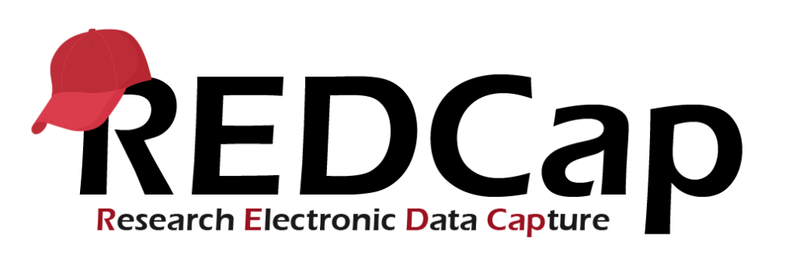{fig-align="center"}

## Desafio en un proyecto de investigación en lo relacionado a los datos

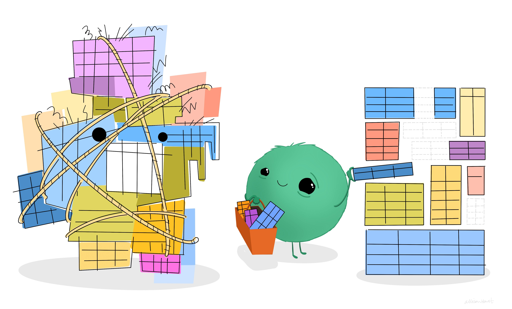

Fuente: Taming the Data Beast, from Allison Horst's [Data Science Illustrations](https://allisonhorst.com/data-science-art)

## Qué es REDCap

*Es una aplicación web:*

-   Versátil y segura

-   En su mayoría de autoservicio

-   Permite crear e implementar rápidamente proyectos de recopilación de datos y encuestas

-   Está diseñado para admitir una variedad de estrategias de captura de datos, flujos de trabajo y requisitos de cumplimiento de seguridad.

Aunque está orientado principalmente a estudios de investigación, también se puede utilizar para apoyar la mejora de la calidad y proyectos operativos.

La aplicación tiene licencia para la Universidad de Vanderbilt. Para obtener más información sobre el consorcio REDCap, visite [REDCap](https://projectredcap.org)

## Qué nos facilita REDCap

::: incremental
-   Gestión completa de la recolección de datos para proyectos de investigacion o con otros fines

-   Distintas estrategia de recolección:

    1.  Encuesta transversal (único momento, con uno o varios formularios)
    2.  Encuesta longitudinal (momento fijos o instrumentos repetidos)
    3.  Recolección multicentrica
    4.  Encuesta web (enlace o correo electrónico)

-   Evaluación en linea de la calidad de los datos con seguimiento sobre cada unidad de observación

-   Diversidad de formatos (Visualizacion de formulario), tipos de datos (texto, numero, archivos, fotos, coordenadas, audio, vídeo)

-   Conexions API desde otras aplicaciones

-   Recolección mediante link, APP (android - Iphone) online u offline
:::

## Requisito obligatorio: Instalación solo y exclusivamente en servidores (Preferiblemente institucional)

Representa la mayor ventaja en la fase recolección de datos, donde recolectan datos sensibles, no es dependiente de un usuario especifico, ni de equipos locales como tecnicos, digitadores o staff investigativo.

# Iniciemos . . .

## Definiendo

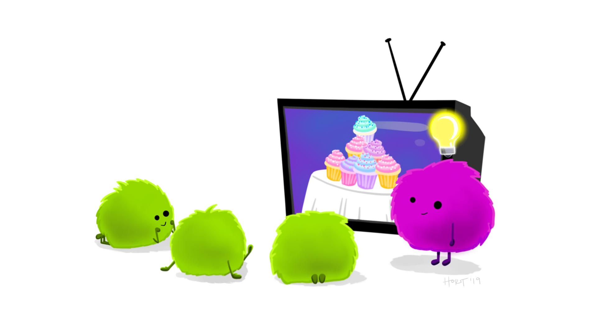{width="70%"}

## Variables - Campos

::: callout-important
**Insumos:** instrumentos, variables - validaciones - secuencia lógica en el diligenciamiento - variables calculadas)
:::

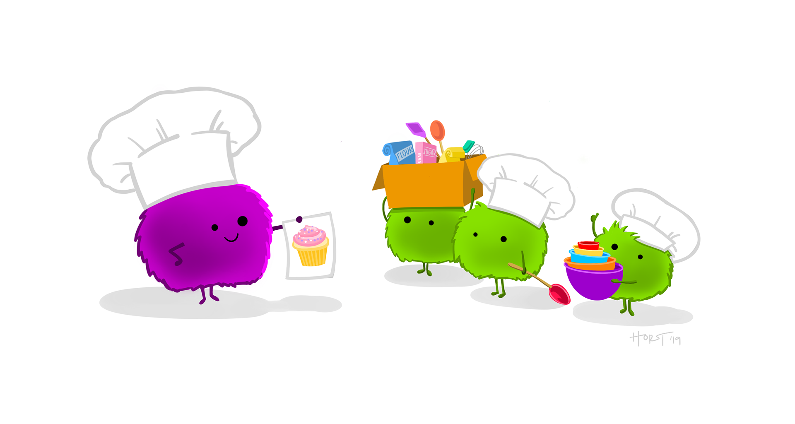{width="70%"}

# Abrir REDCap:

-   Tienes un usuario y clave por tu institución para acceder a la plataforma

-   Acceder a URL institucional de REDCap.

## Fases en el desarrollo

### Fase incial:

::: incremental
1.  Creación del proyecto

2.  Configuración del proyecto

3.  Diseño de formularios
:::

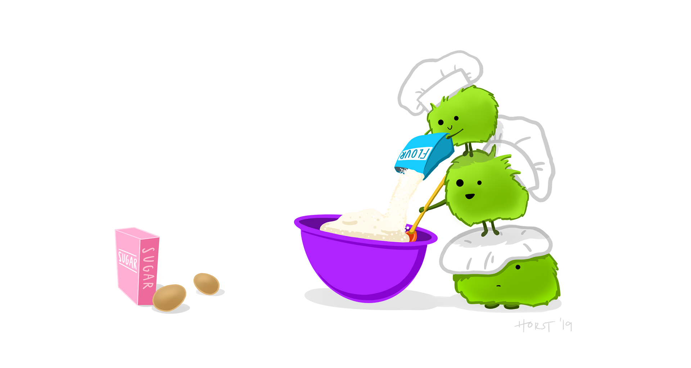{width="60%"}

# Crear proyecto / instrumento

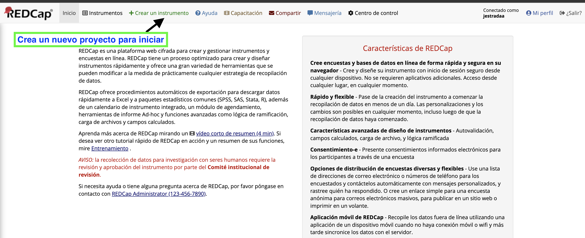{width="100%"}

## Completar campos para creación del proyecto

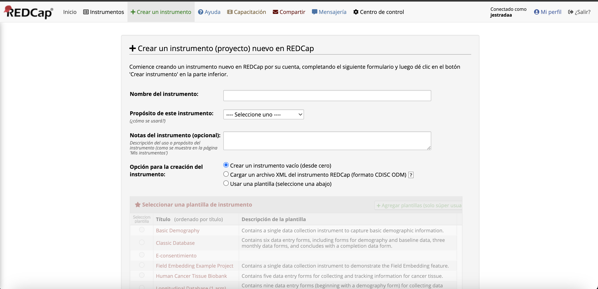{width="100%"}

## Configuración del proyecto

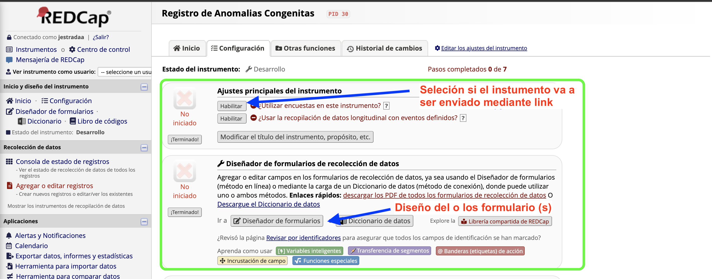{width="100%"}

## Agregar un nuevo campo

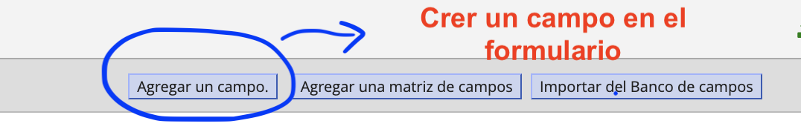{width="100%"}

## Seleccionar un tipo de campo a usar

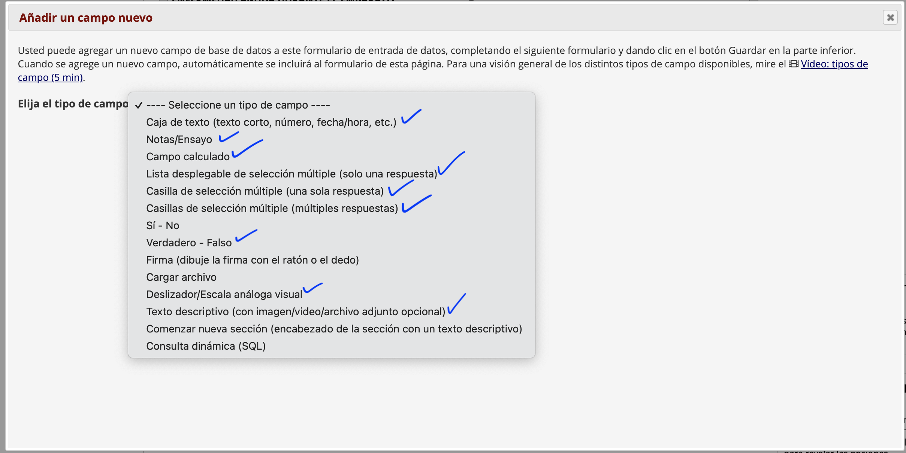{width="100%"}

## Formato de campo

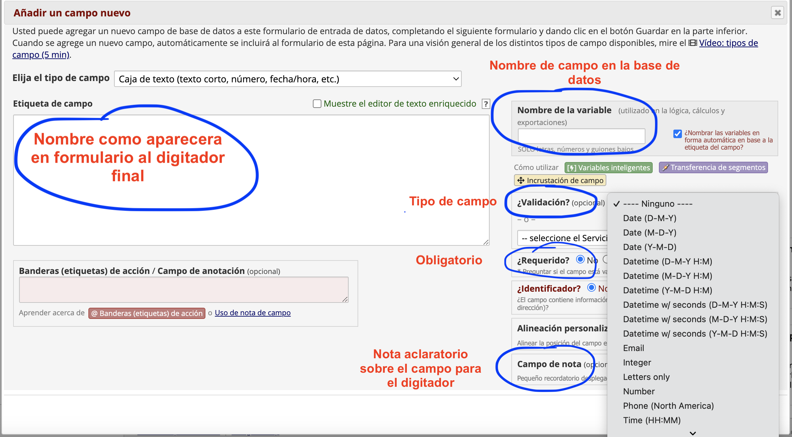{width="100%"}

## Formato de campo

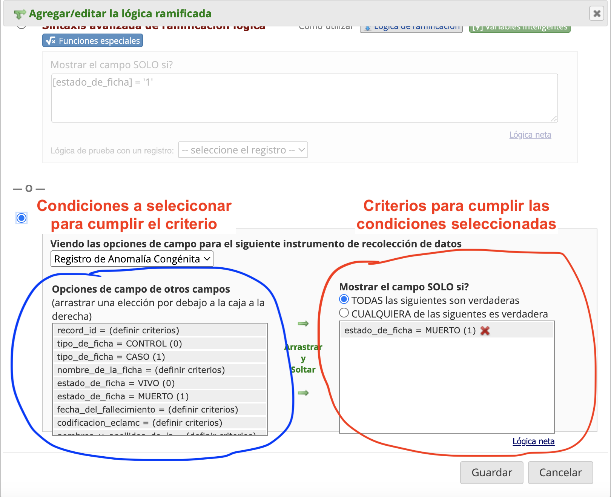{width="60%"}

## Formularios finales

::: columns
::: {.column width="50%"}
**Formulario por defecto**
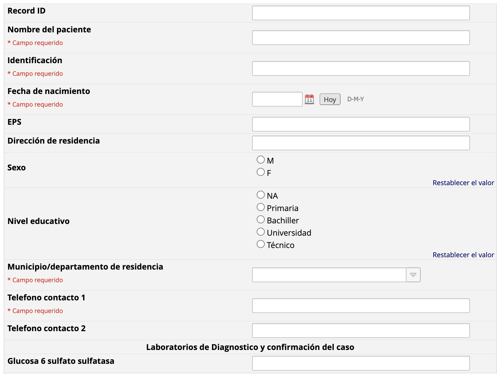{width="100%"}

:::

::: {.column width="50%"}
**Formulario personalizado**

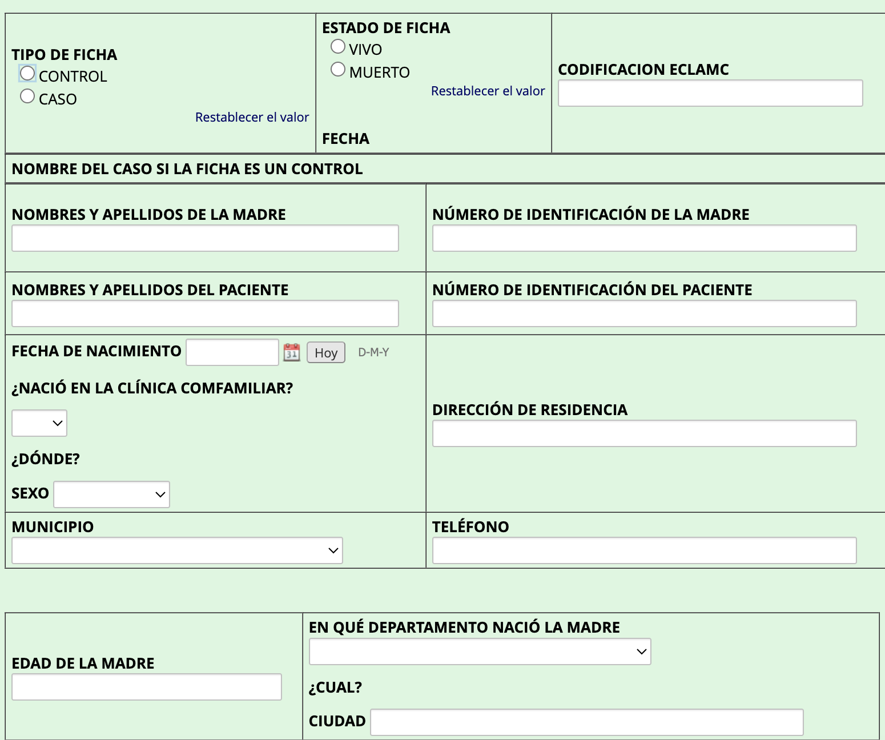{width="100%"}
:::

:::

## Campo embebido

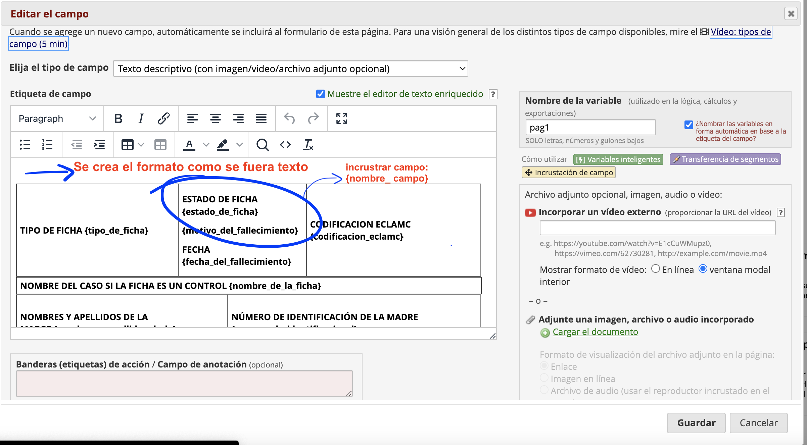{width="100%"}

# Configuraciones finales 

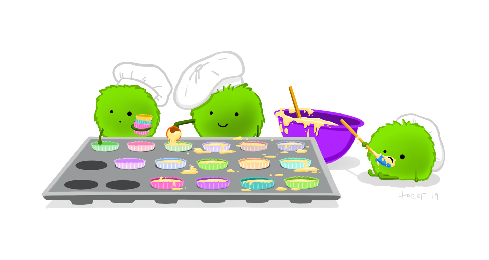{width="100%"}

# Personalizaciones 

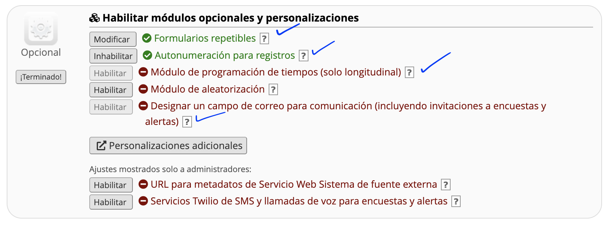{width="100%"}   

# Formulario listo y probado a fondo

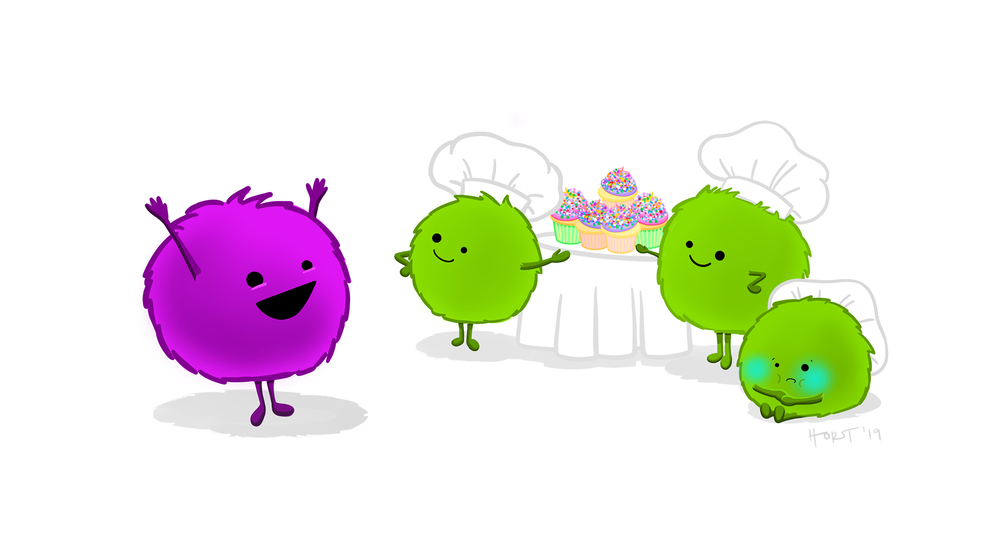{width="100%"}

# Recolección de datos

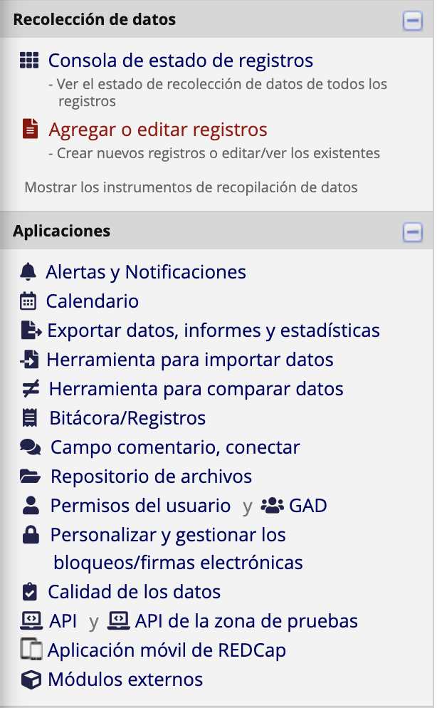{width="30%"}

# Gracias
