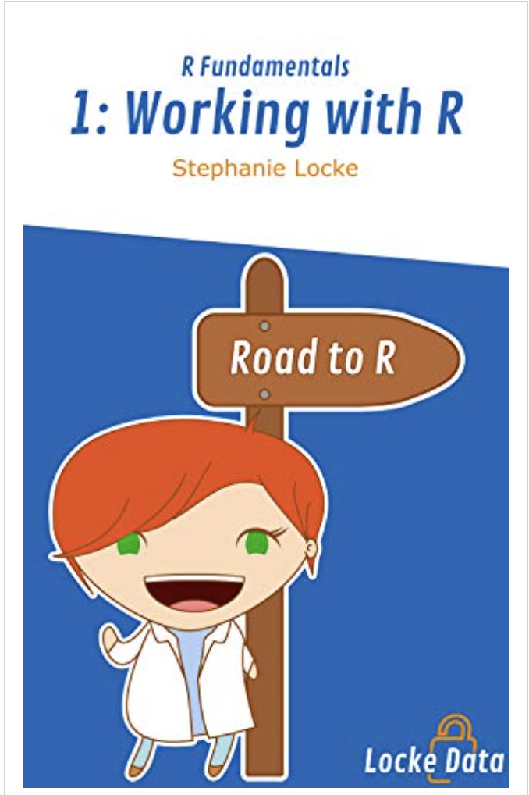
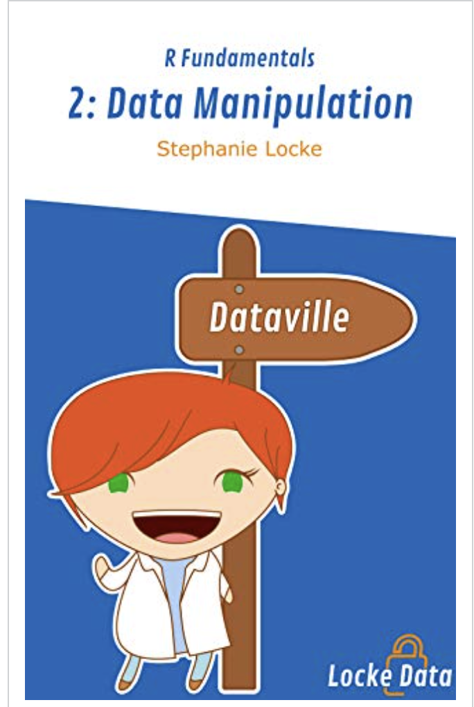

El dia de hoy les traigo varios libros que a mi parecer dan una muy buena guia para iniciar en el mundo de **R** . En aspectos elementales para quienes inician en el lenguaje R.
De la autora

1. Working With R, es el primer libro de la serie Fundamentos de R. El libro lo introduce a los conceptos básicos de R y lo ayuda a ser efectivo tan pronto como comience. Es el primero de una serie de libros que lo ayudarán a usar R para lograr cosas asombrosas en su trabajo diario. Algo importante , es muy practico y ademas corto para seguirlo al tiempo q se desarrollan sus ejercicios propuestos.  <https://a.co/5ugJkhk>

## Un segundo libro de la misma autora:

2. Data Manipulation, cubre todos los requisitos esenciales para trabajar día a día con R. Este libro definitivamente ayudará a aquellos que están pasando de las hojas de cálculo a dominar R. contiene inicios de trabajo en el gran ecosistema de manipulacion de datos conocido como #tidyverse , en especial #tdlyr y #dplyr que no deben faltar en el trabajo de campo en el dia a dia. <https://a.co/3whNuqB>

